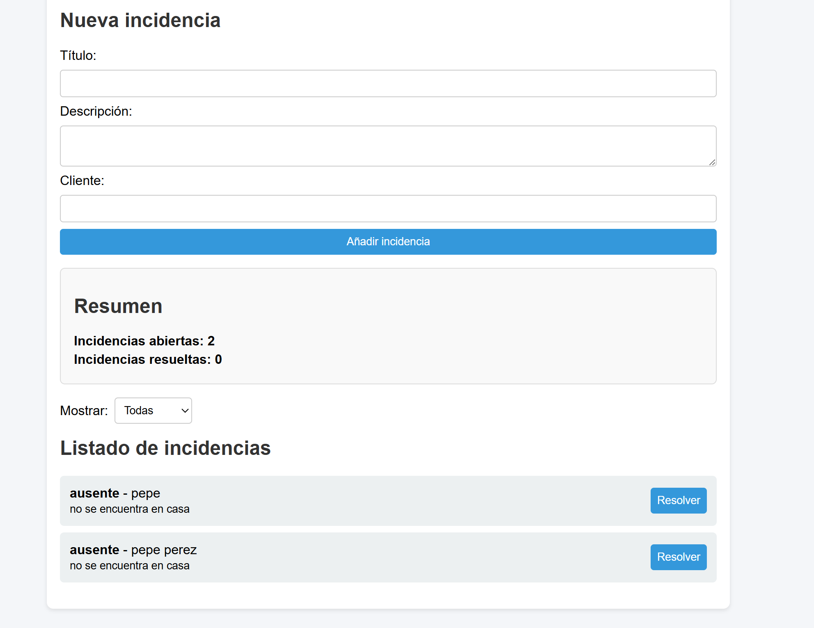

# Mini Gestor de Incidencias

Proyecto sencillo en **HTML, CSS y JavaScript** que simula un pequeño sistema de gestión de incidencias.  
Permite añadir incidencias, listarlas, resolverlas y filtrarlas según su estado.  
Los datos se guardan en el navegador con **localStorage**, por lo que no se pierden al recargar la página.

---

## 🚀 Funcionalidades
- Crear nuevas incidencias indicando:
  - Título
  - Descripción
  - Cliente
- Ver listado de incidencias abiertas y resueltas.
- Marcar incidencias como **resueltas**.
- Contador automático de incidencias abiertas y resueltas.
- Filtro para mostrar:
  - Todas
  - Solo abiertas
  - Solo resueltas
- Persistencia de datos con localStorage.

---

## 📂 Estructura del proyecto

---

## 🖼️ Capturas
### Vista general

*(añade aquí una captura de pantalla cuando lo subas a GitHub)*

---

## 🛠️ Tecnologías utilizadas
- HTML5
- CSS3
- JavaScript (ES6+)
- LocalStorage

---

## 📌 Próximas mejoras
- Editar incidencias ya creadas.
- Asignar incidencias a repartidores.
- Exportar incidencias a archivo CSV.
- Diseño responsive mejorado.

---

## 💡 Autor
Proyecto creado por **María Serna Ruiz**, como práctica personal para reforzar conocimientos de desarrollo web.
